# Spiral Day 使用手册

Spiral Day 是面向 Obsidian 桌面端的插件：用 Markdown 规划一天，并在启用执行层后，对未完成的弹性任务做轻量计时。界面支持英文和简体中文。

规划本身是只读的。只有开始计时、结束计时、推进进度、完成任务这类明确操作才会写回笔记。仅仅打开规划器，插件不会改写日记。

**English manual:** [User guide](user-guide.md)

## 你需要准备什么

- Obsidian 桌面版 1.7.7 或更高。移动端会拒绝加载。
- 一个用 Markdown 写日记的库。
- 插件目录 `<库>/.obsidian/plugins/spiral-day/`，里面有 `manifest.json`、`main.js`、`styles.css`。

插件 ID 固定为 `spiral-day`，不会读取或覆盖旧的 `nautilus-log` 目录。

## 安装

1. 在干净的源码目录执行 `npm ci && npm run build`，或使用已包含上述三个文件的发布包。
2. 创建 `<库>/.obsidian/plugins/spiral-day/`。
3. 把 `manifest.json`、`main.js`、`styles.css` 复制进去。
4. 在 Obsidian 里如有需要先关闭限制模式，然后到 **设置 → 第三方插件** 启用 **Spiral Day**。

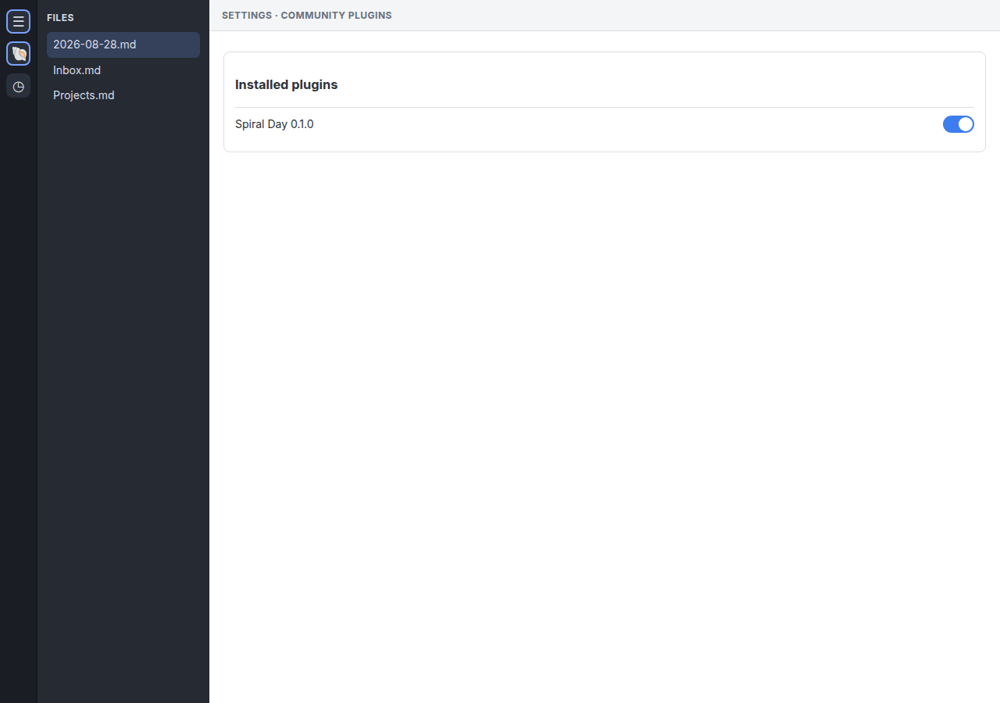

启用后，左侧功能区会出现贝壳图标 **打开 Spiral Day**。这是规划器。计时、计划、回顾和命令面板动作此时都还没有注册。语言切到英文时，该图标仍显示 **Open Spiral Day**。

## 第一次使用：为什么看起来是空的

装完之后最容易卡在这里：

1. **执行层默认关闭**，所以没有计时 / 计划 / 回顾面板，也没有 `Spiral Day:` 命令。
2. 规划器只读「今天」对应的那篇日记。
3. 库里其他位置的待办不会进入计划。
4. 日记必须在行首包含这段计划区域，并且至少有一条直接列表项：

```markdown
<!-- nautilus-log:plan/v1 -->
- [ ] 写发布说明 45m
<!-- /nautilus-log:plan -->
```

没有标记时，规划器会显示「没有主计划」和完整下一步；再点功能区图标也会弹出简短提示。提示只提规划器和设置；启用执行层后才会提到计划标签和回顾（今天）。打开规划器不会自动插入标记。需要插件写入时，在规划器或设置点 **写入今日日记**；启用执行层后，回顾（今天）也可以：它会按需创建今日笔记，并写入标记加一条示例任务。

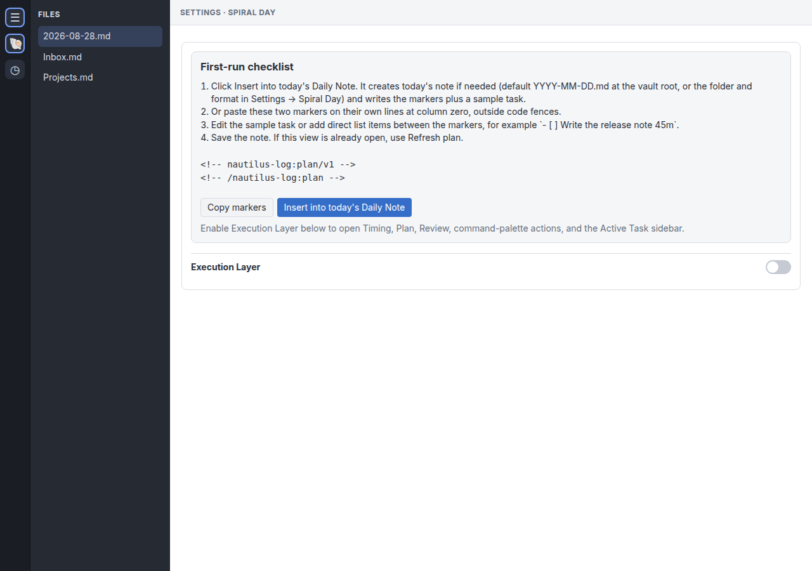

### 第一次使用清单

设置页的清单在计划写好后仍会留着。它不是规划器「没有主计划」的实时诊断。

1. 打开 **设置 → Spiral Day**。第一次启用时会从 Obsidian 复制语言，以及核心日记插件的文件夹和日期格式（若已有）。点 **写入今日日记** 或改任何设置后才会写入插件数据；之后改 Obsidian 或核心日记设置不会覆盖。否则保持默认，或改成和你现有日记一致。
2. 点 **写入今日日记**。没有今日笔记时会按需创建（默认是库根目录下的 `YYYY-MM-DD.md`），并写入标记加一条示例任务。也可以自己建笔记再粘贴计划模板（标记加示例任务）。
3. 点击功能区的 **打开 Spiral Day**。
4. 需要 CLOCK、番茄钟、计时、计划、回顾、当前任务和命令时，再启用 **执行层**。

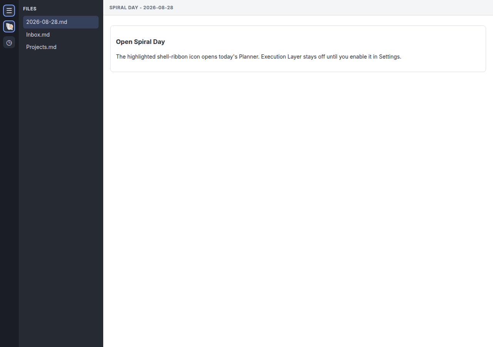

## 写今天的计划

打开今日日记，加入主计划：

```markdown
<!-- nautilus-log:plan/v1 -->
- [ ] 09:00-09:30 站会 ^stand-up
- [ ] 写发布说明 45m
- 午餐 12:00-13:00
- [x] 发送上一份报告 30m
<!-- /nautilus-log:plan -->
```

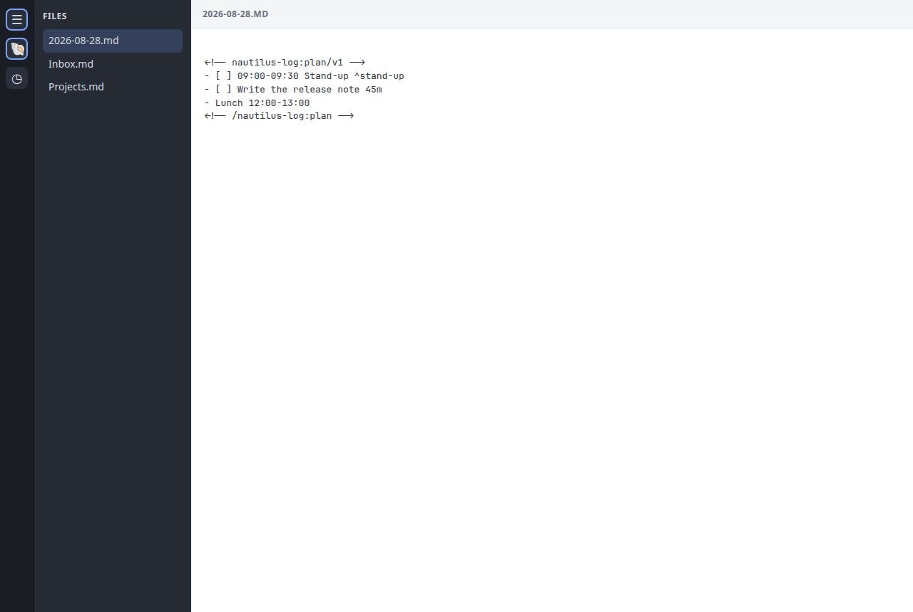

第一天最关键的规则：

- 两个标记都在行首，不要放进代码块。
- 只有标记之间的**直接**无序列表项（`-`、`+` 或 `*`）会成为计划项。
- 嵌套列表、有序列表、标记外的任务都会被忽略。
- `[ ]` 是未完成任务；`[x]` / `[X]` 是已完成；没有复选框的项能看见，但不能开始计时。
- `09:00-09:30` 这样的时间范围会变成**固定事件**。
- `45m` 这样的时长（或设置里的默认时长）会变成**弹性任务**，由调度器放进空闲时间。
- 只解析每一项的第一行。

如果还没有标记，规划器会给出计划模板、**复制计划模板**、**写入今日日记**，以及启用执行层后该去哪里打开计时 / 计划 / 回顾。如果标记已经在、但列表是空的，会显示 **复制示例任务**，而不是写入。

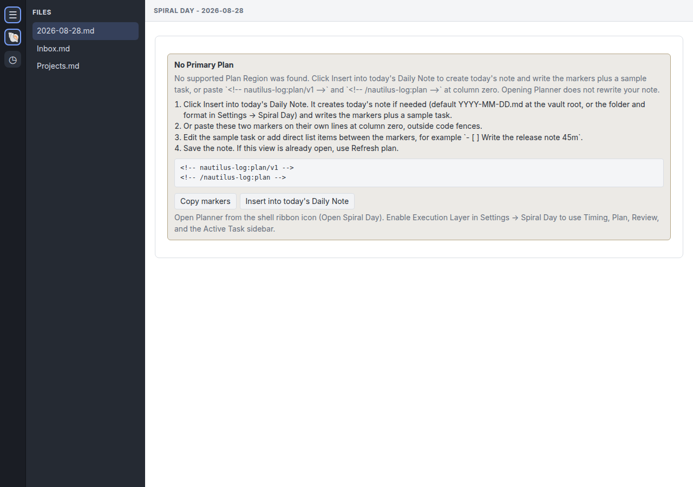

保存笔记。如果规划器已经打开，点 **刷新日程**。

## 每天怎么用

典型一天：

1. 在今日日记里写好主计划。
2. 用功能区贝壳图标打开**规划器**，看容量、固定事件、已排期任务和溢出。
3. 启用一次**执行层**。用计时器功能区打开 **计时**、**计划**、**回顾**。
4. 对未完成的 `- [ ]` 弹性任务开始计时：计划标签、编辑器右键，或 `Spiral Day: 1. 聚焦当前任务`。
5. 做完就结束计时。在计划标签或规划器里推进进度或完成。
6. 用**回顾**对比计划用时和实际用时。只想看「做完却超时」的任务时，勾选 **只看已完成的超时任务**。

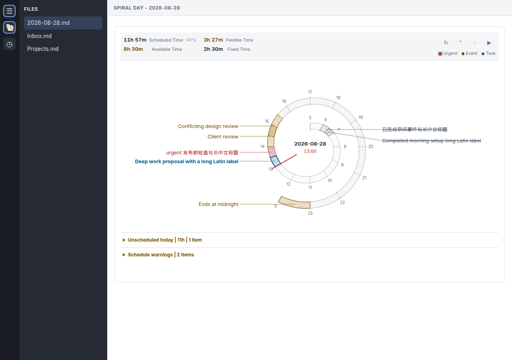

## 各个界面

### 设置

**设置 → Spiral Day** 支持 `English` / `简体中文`。第一次使用清单固定在顶部。它是说明，不是规划器的实时诊断：写入成功后仍会留在顶部，并不表示「没有主计划」仍然成立。

入门时最重要的几项：

| 设置 | 默认 | 为什么重要 |
| --- | --- | --- |
| 语言 | 第一次启用时从 Obsidian 复制（`en` / `zh`） | 立刻切换规划器、执行界面、命令面板、编辑器菜单和规划器功能区文案。写入今日日记或改设置后会保存；之后以插件设置为准。 |
| 日记文件夹 | 第一次启用时从核心日记插件复制，否则为空（库根目录） | 必须和「写入今日日记」创建、规划器读取的笔记一致。写入或改设置后会锁定，之后改核心日记插件不会挪路径。无效目录会恢复为上次可用的值。 |
| 日记日期格式 | 第一次启用时从核心日记插件复制，否则 `YYYY-MM-DD` | 必须包含年、月、日标记（`YYYY`、`MM`/`M`、`DD`/`D`）。写入或改设置后会锁定。不支持 `dddd` 这类星期名；无效格式会恢复为上次可用的值。若核心日记已经在用这些标记，设置页会说明没有复制该格式。 |
| 默认任务时长 | 15 分钟 | 弹性任务没有 `30m` / `2h` 时使用。 |
| 执行层 | 关闭 | 打开后才有计时、计划、回顾、命令和当前任务。 |

全部取值见 [设置参考](reference/settings.md)。

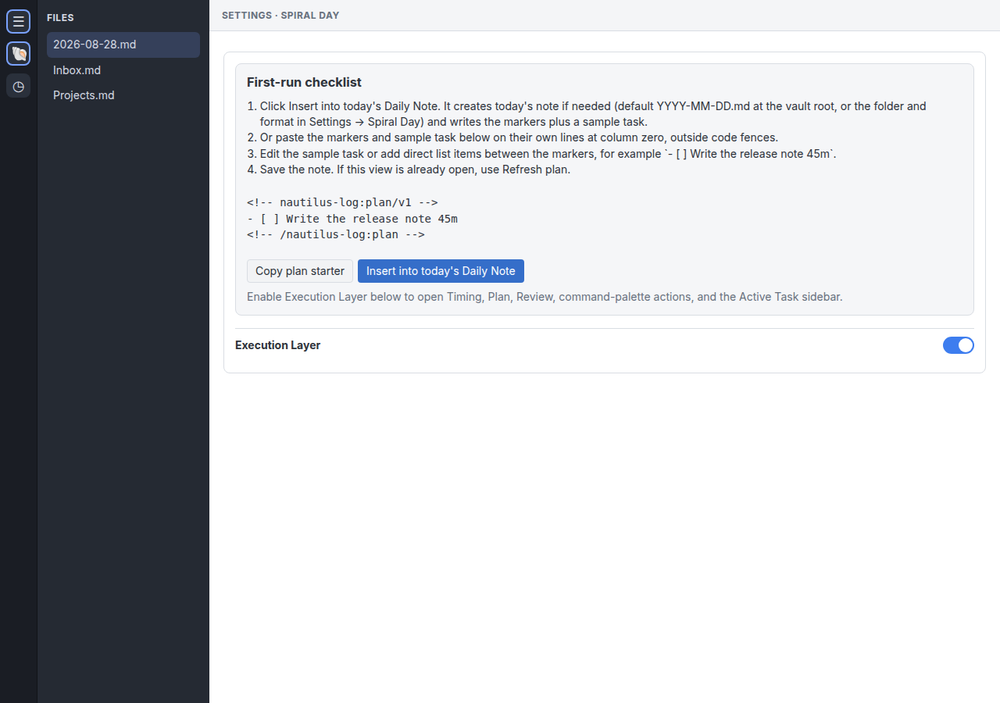

### 规划器

通过功能区贝壳图标 **打开 Spiral Day** 打开，始终对应今天的配置日记。

你可以：

- 看容量（固定、弹性、已排期、可用）。
- 看螺旋日程、溢出和警告。
- 隐藏或显示已完成项。
- 复制日程摘要。
- 回放一天，结束后回到实时计划。
- 改完日记后刷新。
- 在执行层开启后，在行上推进或重新打开进度。

打开或刷新规划器不会插入区块 ID。只有需要身份的明确写入，才会在同一次编辑里生成 `^nl-<uuid>`。

### 计时

启用执行层后，点击计时器功能区。面板默认停在 **计时**。

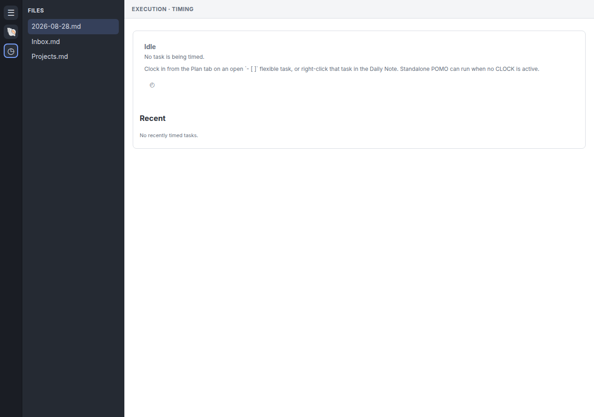

- 空闲：没有 CLOCK。空态会说明：还没有主计划时，先在计划标签点 **写入今日日记**；然后才能在计划标签或编辑器开始计时。也可以开独立番茄钟。
- 进行中：显示当前任务、已用时间、结束计时，以及可选的「忘记停止」提醒。
- 最近：按设置保留已关闭的 CLOCK。

番茄钟阈值只改变警告样式，不会自动停止。忘记停止也只是警告，不会自动结束计时。

### 计划

计划标签列出今日主计划里已排期和未排期的未完成任务。

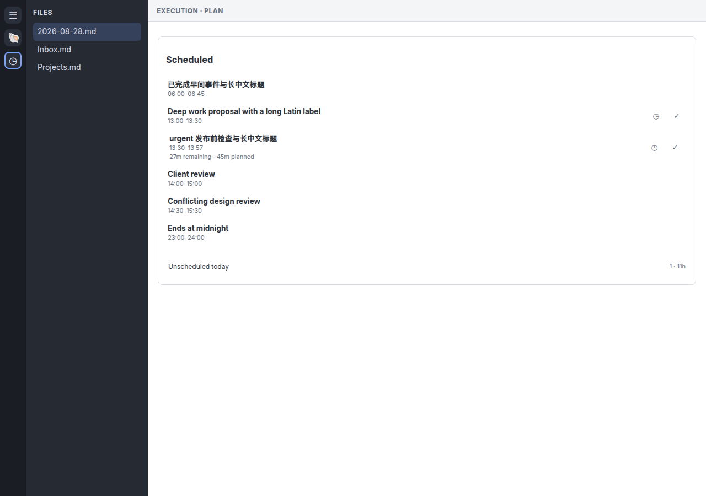

- 点击标题打开源行；Shift-点击在右侧栏打开。
- **开始计时** 会占用唯一的当前任务。
- **完成** 每次推进 10%，到 100% 时完成任务。
- 已排期且有部分进度的行，会同时显示剩余时长和原计划时长。
- 重新打开已完成任务请用规划器，不要用这个标签。

如果显示「今天没有找到主计划」，可点 **写入今日日记**，或使用同一套标记清单。空的 **今日未排程** 表示所有未完成的弹性任务都已排进日程，并不表示没有未完成任务。若已排程为空只是因为条目都已完成或不能计时，会提供 **复制示例任务**，方便再加一行未完成的 `- [ ]`。

### 回顾

回顾按所选日期对比计划用时和实际用时。

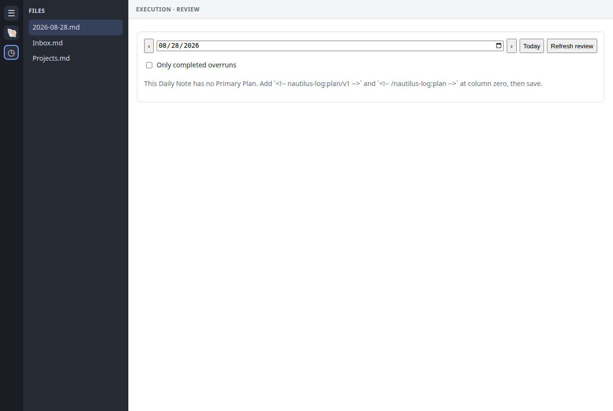

- **今天** 可以操作；过去和未来的日期只读。
- **只看已完成的超时任务** 会隐藏其他行，但全天汇总仍覆盖整天。
- 缺少日记或缺少主计划时，界面会说明如何创建笔记、如何加标记。所选日期是今天时，可点 **写入今日日记**。

### 当前任务

这是右侧栏里的单例视图，跟随当前 CLOCK，可打开源行、复制块链接、结束计时。

如果开启了 **将计时线保持在右侧栏首位**，成功开始计时后会打开这个视图。

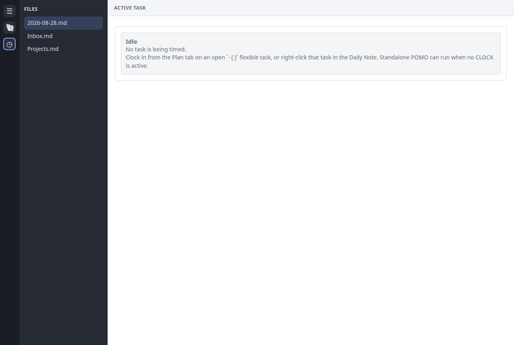

### 命令和编辑器菜单

只有启用执行层后才有：

- `Spiral Day: 1. 聚焦当前任务` — 对光标所在的未完成任务开始计时。如果当前不是 Markdown 笔记，或光标不在未完成的 `- [ ]` 弹性任务上，提示会指向今日日记或「计划」标签的 **开始计时**。
- `Spiral Day: 2. 结束计时线` — 当前没有计时任务时，提示会说明这一点，并指向「计划」标签的 **开始计时**。
- `Spiral Day: 3. 定位主计划` — 即使还没有主计划，也会打开今日日记。笔记不存在时，提示去点 **写入今日日记**。

在符合条件的未完成弹性任务上右键，可 **Spiral Day: 开始计时**；在当前计时任务上右键，可 **Spiral Day: 结束计时**。语言为英文时，命令名仍是 `Focus current block` / `Clock in`。

## 一天流程一览

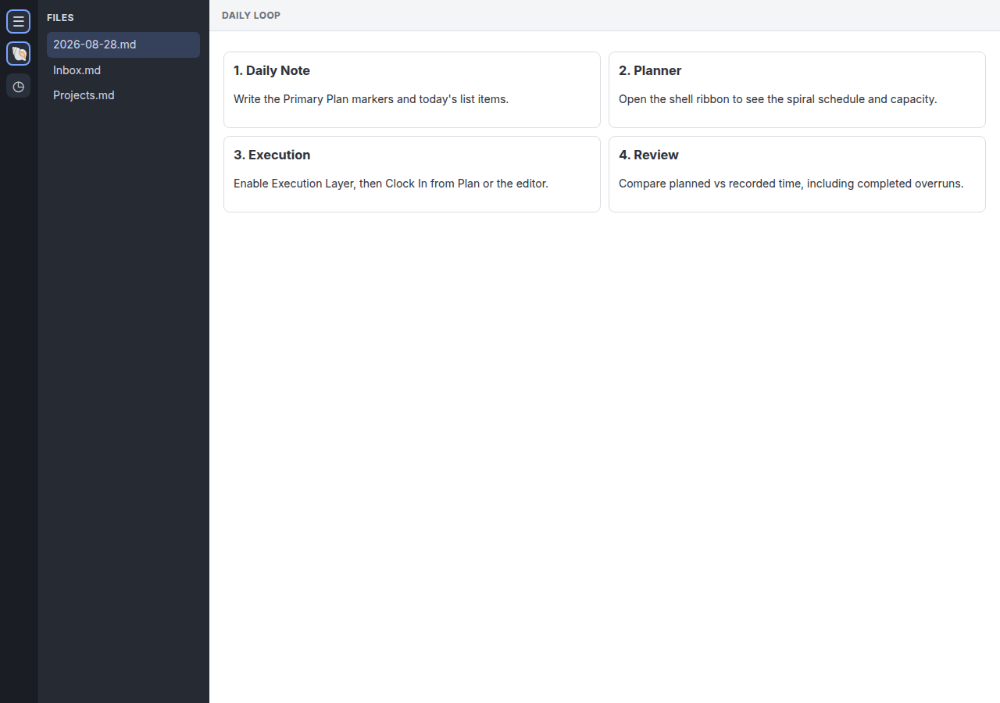

## 每天会用到的语法

完整语法见 [Markdown grammar v1](reference/markdown-grammar-v1.md)。

| 你写的 | 规划器读到的 |
| --- | --- |
| `<!-- nautilus-log:plan/v1 -->` … `<!-- /nautilus-log:plan -->` | 唯一的主计划 |
| `- [ ] 写文档 45m` | 未完成弹性任务，45 分钟 |
| `- [ ] 14:00-15:00 评审` | 固定事件 |
| `- 午餐 12:00-13:00` | 可见的固定事件，不能开始计时 |
| `- [x] 已完成 30m` | 已完成；规划器可提供重新打开 |
| `` `- [ ] 示例 30m` `` | 只显示，不参与排期 |
| 行末 `^stand-up` | 稳定的计划项 ID |

重命名或移动任务时请保留唯一的行末 ID。同一个 ID 出现两次，依赖身份的操作会被关闭，直到你修好冲突。

## 安全编辑

- 不要把标记放进代码块，也不要缩进。
- 不要把同一个 `^id` 复制到两项。
- 如果写入提示源已变化，先保存、刷新，再从当前行重试。不要在重试时复制出第二行。
- 同一时间只能有一个 CLOCK 写入器。启用执行层前，请关掉其他 CLOCK 扩展。
- CLOCK / LOGBOOK 写在 Markdown 里。设置和番茄钟开始时间存在插件数据中。

## 排障

先看插件里的空态说明，再到 [排障文档](troubleshooting.md)。

| 现象 | 处理 |
| --- | --- |
| 规划器说没有主计划 | 点 **写入今日日记**，或在行首粘贴计划模板，保存并刷新。 |
| 粘贴后规划器或回顾仍是空的 | 笔记里有标记但没有列表项。点 **复制示例任务**，粘贴到标记之间，保存并刷新。 |
| 装完只有一个功能区图标 | 正常。执行层打开后才有其他界面。 |
| 某一行没有「开始计时」 | 必须是直接的未完成 `- [ ]` 弹性任务，不能是固定事件或嵌套项。 |
| 命令面板找不到命令 | 先启用执行层，再搜索 `Spiral Day:`。 |
| 找不到日记 | 文件夹必须是库内相对路径；格式必须包含 `YYYY` 以及月、日标记。设置会拒绝 `dddd`，并恢复为上次可用的值。 |
| 写入时提示文件挡住了文件夹 | 今日路径的某一级已经是一篇笔记。先重命名或移走该文件，再点「写入今日日记」。 |
| 回顾是空的 | 这一天没有可回顾任务，日记 / 主计划缺失，或只有标记没有列表项。 |
| 写入过期或不可用 | 保存笔记，刷新，从当前行重试。 |

## 相关文档

- [设置参考](reference/settings.md)
- [Markdown grammar v1](reference/markdown-grammar-v1.md)
- [排障](troubleshooting.md)
- [术语表](../CONTEXT.md)
